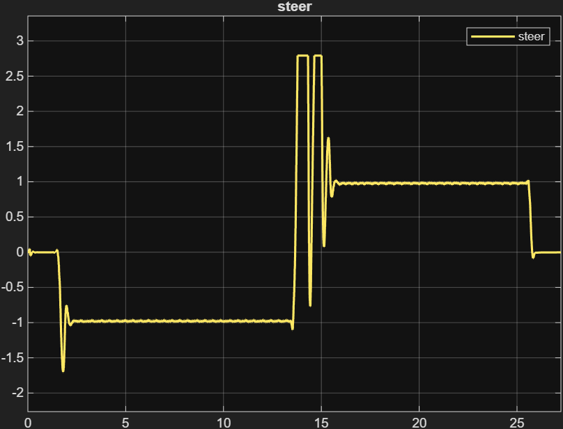

# Engineering portfolio

### Driver-in-the-Loop Simulation: MPC & PID Vehicle Controller

**Objective:** Engineered an advanced path-following controller within Simulink to simulate realistic driver inputs for dynamic vehicle evaluation.

**Technical Implementation:**
*   **Plant Architecture:** Structured a 4-state single-track vehicle dynamics model in MATLAB, defining the state-space matrices through precise parameterization of vehicle mass, yaw inertia, and tire cornering stiffness.
*   **Control Logic Integration:** Implemented a Model Predictive Control (MPC) algorithm for optimal trajectory tracking, functioning in tandem with a PID controller to govern the throttle pedal and braking one.
*   **Feedforward Calibration:** Designed and integrated a steering feedforward logic to enhance the predictive response of the path-tracking algorithm. Restructured the variable calculation loops, resolving an inactive conditional block to guarantee uninterrupted feedforward data transmission during high-dynamic maneuvering.
*   **Simulation & Validation:** Deployed the integrated controller within a driver-in-the-loop environment to evaluate transient vehicle behavior and dynamic stability under simulated track conditions.

### MPC Architecture & Theoretical Foundation

A key defining factor of this project was the decision to develop the control architecture entirely from scratch, bridging fundamental vehicle dynamics theory with advanced control system implementation.

**Theoretical Framework & Literature**

Rather than relying on pre-packaged driver models, the predictive algorithm was mathematically derived from core literature. The control logic and plant matrices were built following established methodologies from:
*   *[MathWorks Website]* - Referenced for structuring the objective function and prediction horizon tuning within the MPC framework.
*   *[Vehicle Dynamics and Control by R. Rajamani]* - Utilized for defining the state-space formulation of the lateral dynamics.

**From Scratch Implementation**
The development process deliberately separated the physical vehicle plant from the driver model. By focusing heavily on the driver-side algorithm, we established a robust Model Predictive Controller capable of:
1.  **Solving the Optimization Problem:** Calculating optimal steering angles by minimizing the cost function over a defined prediction horizon, strictly adhering to track boundary constraints.
2.  **Handling Actuator Limits:** Explicitly integrating physical steering constraints (rate and angle limits) into the MPC solver to ensure the generated commands are physically executable by the vehicle's steering rack.
3.  **Future State Prediction:** Utilizing the internally coded 4-state mathematical model to predict the vehicle's lateral deviation and yaw error, allowing the algorithm to preemptively react to upcoming trajectory curvatures.

### System Architecture & Control Layout

*Fig.1: Simulink layout for MPC & PID Driver-in-the-Loop simulator.*

**Architecture Rationale:** The environment was developed to bridge the gap between theoretical path-tracking and real-world testing. By structuring a modular 4-state single-track plant, the setup allows for the safe, repeatable evaluation of transient vehicle dynamics prior to physical track deployment. The signal routing strictly enforces double precision data type conversions throughout the control loops, guaranteeing mathematical consistency between the predictive algorithms and the continuous physical states of the vehicle model.

### Dynamic Validation & Tracking Performance

To validate the controller's effectiveness under high-dynamic maneuvering, the system was subjected to simulated track layouts. The plots ent color coding for lead and follow trajectory elements, ensuring immediate visual feedback on controller accuracy.

*Fig.2: Lateral cross-track error distribution for a Formula Student Skid Pad event (m).*

The lateral error remains tightly bounded throughout the simulation. This demonstrates the MPC's predictive capability to hold the designated racing line and optimally manage slip angles, even during aggressive transient cornering phases.

*Fig.3: Yaw Heading Error (rad).*

This plot illustrates the alignment deviation between the vehicle's actual heading and the target path. Minimizing this specific metric is critical for maintaining lateral stability and mitigating unintended oversteer scenarios during mid-corner transitions.

*Fig.4: Steering input command (rad).*

The steering command output confirms that the feedforward logic generates smooth, realistic driver inputs. Measured in radians, the values remain well within the physical actuation limits of a standard Formula Student steering rack, preventing actuator saturation and erratic dynamic responses. 

### Limitations & Future Developments

While the current MPC architecture provides a robust baseline for path-tracking, the driver model is part of an ongoing iterative development process. Targeted areas for future improvement include:

*   **Combined Slip Management:** Expanding the control logic to concurrently manage lateral and longitudinal slip ratios, fully integrating the steering MPC with dedicated traction and launch control architectures.
*   **Spikes in the simulation:** Improving the simulation by deleting those spikes at the changing direction from one circle to the other one. 
*   **Real-Time 3D Simulation:** Porting the mathematical control logic into a real-time interactive environment, utilizing custom vehicle physics and skeletal meshes to evaluate the driver-in-the-loop response with direct visual feedback.
*   **Adaptive MPC:** Replacing the current MPC Controller with an adaptive one which refreshes at every loop the defining matrices.
*   **In-House MPC:** Coding our own MPC Controller.
