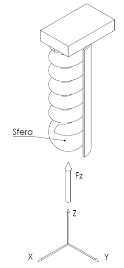

Welcome to my engineering portfolio. Select a project below to explore the technical documentation, mathematical models, and software implementations.

---

### [Driver-in-the-Loop: MPC & PID Vehicle Controller](mpc-simulator.html)

**Domain:** Vehicle Dynamics & Advanced Control Systems | **Tools:** MATLAB, Simulink, Git
> *Engineered an advanced path-following Model Predictive Controller from scratch to simulate realistic driver inputs for dynamic vehicle evaluation.*

 

### [Structural Analysis: Helical Spring Boundary Conditions](spring-analysis.html)

**Domain:** Solid Mechanics & Mathematical Modeling | **Tools:** WxMaxima, Marc Mentat (FEM), SolidWorks
> *Analytical investigation of mechanical boundary constraints on helical springs under multi-axial loading, validated through Finite Element Analysis.*

---

