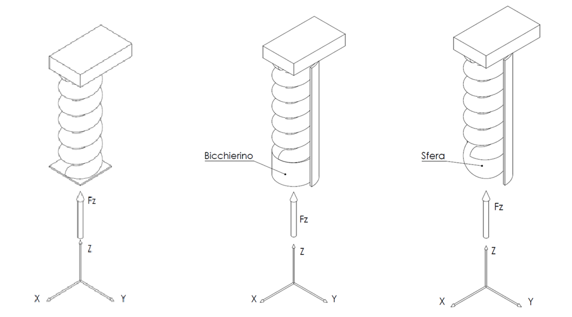
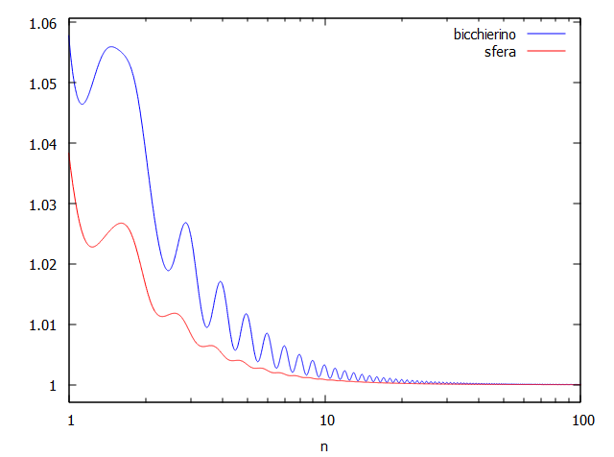
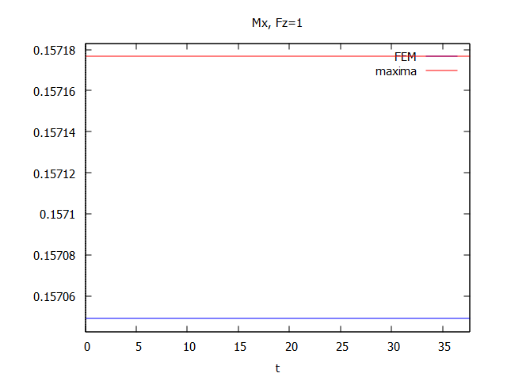

# Structural Analysis: Helical Spring Boundary Conditions

**Objective:** Investigated the mechanical behavior and stiffness variations of a helical spring under multi-axial loading, focusing on the influence of distinct physical boundary conditions (free spring, cylindrical constraint, and spherical joint).

**Technical Implementation:**
*   **Analytical Modeling:** Parametrized the spring's wire geometry and formulated the 6 equilibrium equations to define internal forces (axial, shear) and moments (bending, torsional) acting on a generic cross-section.
*   **Energy Method Application:** Utilized Castigliano's Theorem via the *WxMaxima* algebraic manipulator to compute spatial displacements and rotations by deriving the total elastic strain energy.
*   **FEM Validation:** Replicated the mathematical model within *Marc Mentat* to conduct a rigorous Finite Element Analysis comparison.

### Boundary Condition Scenarios

To evaluate the operational stiffness of the spring, the analytical model was subjected to three distinct mechanical constraints:

1.  **Free Spring:** Loaded purely along the Z-axis with unconstrained lateral spatial movement.
2.  **Cylindrical Constraint (Slider):** Simulated a standard enclosure (e.g., a suspension cup) negating lateral deflections ($fx=0, fy=0, rx=0, ry=0$).
3.  **Spherical Joint on Guide:** Allowed rotational freedom while constraining lateral translation.

  
   
  <em>Fig. 1: Simulink layout for MPC & PID Driver-in-the-Loop simulator.</em>

 

### Key Findings & Analytical Results

By solving the linear systems for the constraint reactions, the analysis highlighted critical behaviors depending on the number of active coils ($n$):

*   **Asymptotic Stabilization:** The structural influence of the cylindrical constraint (slider) compared to a free spring strongly fluctuates for low coil counts, but stabilizes asymptotically for $n > 30$, where the difference in axial deflection becomes negligible.
*   **Classic Theory Validation:** When comparing the rigorous mathematical derivation of the free spring with the simplified textbook formulation (assuming small pitch angles and adial loads), the displacement models showed a discrepancy of **less than 1% (ratio of 0.9943)**. This confirms that classical textbook formulations correctly operate with a slight margin of safety.

  
   
  <em>Fig. 1: Simulink layout for MPC & PID Driver-in-the-Loop simulator.</em>

 

### Finite Element Method (FEM) Validation

To definitively validate the algebraic model built in WxMaxima, a continuous load simulation was executed using *Marc Mentat* FEM software. 

The comparison of the internal stresses, specifically focusing on the bending moment $Mx$ under a unitary axial load $Fz$, demonstrated an exceptional correlation between the analytical script and the FEM solver. The calculated relative error between the two methodologies peaked at **0.0808%**, fully validating the structural assumptions and the mathematical framework of the project.

  
   
  <em>Fig. 1: Simulink layout for MPC & PID Driver-in-the-Loop simulator.</em>

 

 

**[⬅ Return to Portfolio Home](index.html)**

